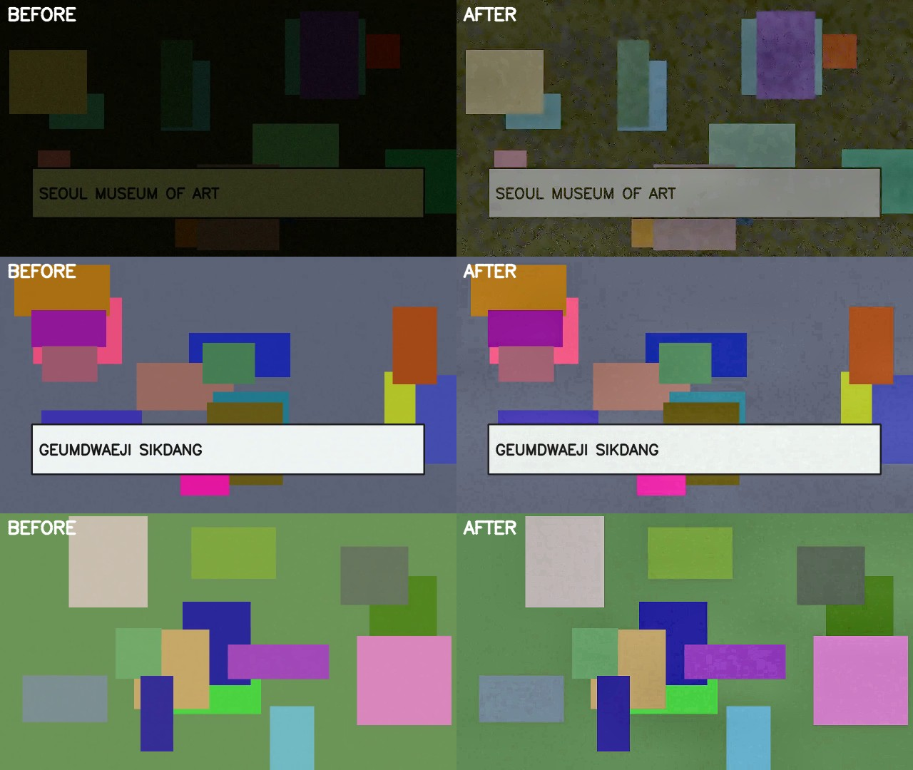

# 비전 프론트엔드 — VLM 앞단의 프레임 선별·복원

> `apps/api/app/pipeline/vision/` · Phase 3 AI 파이프라인의 B안 입력단
>
> **먼저 읽을 것:** [설계 결정과 실패 기록](vision-frontend-decisions.md) — 무엇이 틀렸고 어떻게 알았는지 시간순 요약.
> 이 문서는 구현 설명과 측정 전체다. **현재 결론: 합성 장면 8/8 이지만 유튜브 실영상에서 선별은 무작위 수준
> (개발 4/26, 사전 등록 테스트 3/35)이며, 대안 `text_nms` 는 테스트에서 기각됐다.**

## 왜 만들었나

Pind는 YouTube 영상에서 창작자가 방문한 장소를 뽑아 지도에 꽂는다. 장소를 알아내는 단서 중
가장 결정적인 것은 **간판에 적힌 가게 이름**이다. 그래서 파이프라인의 성패는 "간판이 읽히는
프레임을 VLM에게 보여줬는가"로 거의 결정된다.

그런데 영상을 1 fps로 균일 샘플링해 그대로 VLM에 넘기면 두 가지가 동시에 잘못된다.

1. **대부분이 중복이다.** 브이로그는 한 가게에서 수십 초를 머문다. 10분 영상 600프레임 중
   실제로 서로 다른 장면은 수십 개뿐이고, 남은 프레임은 토큰만 쓰고 새 정보를 주지 않는다.
2. **정작 필요한 프레임이 못 읽히는 상태다.** 걸으면서 찍은 구간은 모션 블러로 글자가 뭉개지고,
   실내 카페·전시장은 노출이 무너져 간판이 어둠에 잠긴다.

두 문제의 해결 방향이 반대라는 점이 핵심이다. 중복은 **버려야** 하고, 품질이 나쁜 프레임은
(버리는 게 아니라) **복원해야** 한다. 어두운 프레임을 "품질 미달"로 버리면 실내에서 방문한
장소가 파이프라인에서 통째로 사라진다.

## 파이프라인

```
ffmpeg 균일 샘플링 (1 fps, 긴 변 1280px)
        │
        ▼
┌───────────────────────────────────────────────┐
│ 프레임별 분석 (청크 32장 스트리밍)            │
│  · 화질 지표  (선명도 / 노출 / 노이즈 / 채도) │
│  · 간판 문자 점수 (MSER)                      │
│  · 저조도 구제  ← 게이트보다 먼저!            │
│  · 임베딩 (pHash+HSV 또는 DINOv3)             │
└───────────────────────────────────────────────┘
        │
        ▼
화질 게이트 — 복원해도 못 읽는 프레임만 탈락
  · 모션 블러 (±3초 이웃 중앙값 대비 + 영상 중앙값 기준 절대 하한)
  · 노출 파탄 (흑/백 포화가 복원 한계를 넘음)
        │
        ▼
샷 분할 — 인접 임베딩 코사인 유사도가 임계 아래로 떨어지는 지점을 컷으로
           (임계는 영상 자신의 인접 유사도 분포에서 결정)
        │
        ▼
샷별 대표 1장 — readability_score 최대 (선명도·노출·대비·채도·문자 점수 가중합)
        │
        ▼
전역 중복 샷 제거 — 같은 가게 재방문 컷 병합 (그리디, 앞선 샷 우선)
        │
        ▼
예산 컷 — max_keyframes, 점수 순이 아니라 장면 다양성 순 (k-center greedy)
        │
        ▼
미니 ISP 보정 (문자 영역이 줄면 구제본으로 되돌림) → JPEG 저장 → VLM 입력
```

### 순서에 대한 설계 결정

**저조도 구제가 화질 게이트보다 앞에 온다.** 이것이 이 모듈에서 가장 중요한 한 줄이다.
처음 구현은 게이트를 먼저 두었고, 그 결과 합성 검증 영상의 실내 전시장 장면(평균 휘도 0.067)
7프레임이 전부 `underexposed`로 탈락해 "SEOUL MUSEUM OF ART" 간판이 결과에서 사라졌다.
순서를 뒤집어 구제를 먼저 하도록 바꾸자 같은 장면이 대표 키프레임으로 선별됐다.

그래서 게이트의 의미도 달라졌다. 게이트는 이제 "품질이 낮은 프레임"을 거르지 않고,
**"복원해도 읽을 수 없는 프레임"만** 거른다. 구제 가능/불가능의 경계는 설정으로 분리했다
(`rescue_luma_below` vs `unrecoverable_luma_below`).

구제 경로(`rescue_exposure`)는 WB + 감마 + CLAHE만 쓴다. 전체 프레임에 적용되므로
디노이징·샤프닝처럼 비싼 단계는 빼고, 최종 선별된 소수 프레임에만 전체 ISP를 적용한다.

## 미니 ISP

브이로그 프레임은 이미 카메라 ISP를 거친 sRGB JPEG다. 여기서 하는 일은 RAW 복원이 아니라,
**ISP 후단 블록을 sRGB 도메인에서 다시 적용해 "읽을 수 있는" 프레임을 만드는 것**이다.

| 단계 | 방법 | 근거 |
|---|---|---|
| 화이트밸런스 | Shades-of-Gray, Minkowski p=6 | Finlayson & Trezzi, CIC 2004. p 하나로 Gray-World(p=1)~White-Patch(p=∞)를 잇는다. 광원색에 끌려간 간판은 글자 대비가 떨어진다 |
| 톤 | 적응 감마 `γ = log(target)/log(mean)` | 전역 톤커브 1회. 히스토그램 평활화와 달리 색상 왜곡이 없다 |
| 노이즈 | 조건부 NL-Means, **감마 후** σ 기준 | Buades et al., CVPR 2005. 강도 `h ≈ 2.5σ` |
| 로컬 콘트라스트 | LAB의 L 채널에만 CLAHE | Zuiderveld, 1994. 색 채널을 건드리지 않아 채도 과장이 없다 |
| 샤프닝 | 언샤프 마스킹, 선명도 < 기준의 60%일 때만 | 이미 선명한 프레임에 걸면 링잉과 노이즈만 늘어난다 |

### 디노이징 판정 시점

여기서도 순서가 결과를 갈랐다. 처음에는 원본 프레임의 σ로 디노이징 여부를 정했는데,
**어두운 프레임은 화소값 자체가 눌려 있어 노이즈 진폭도 같이 눌린다.** 검증 영상의 전시장
프레임은 원본 σ=1.26으로 임계(6.0)에 한참 못 미쳐 디노이징이 걸리지 않았고, 감마로 2배
이상 들어올린 뒤 CLAHE까지 거치자 σ=5.93까지 증폭돼 결과물이 지저분했다.

측정값:

| 단계 | 추정 σ (0~255) |
|---|---:|
| 원본 (휘도 0.067) | 1.26 |
| 감마 후 (γ=0.45) | 3.22 |
| CLAHE까지 (디노이징 없음) | 5.93 |
| 디노이징(h=4) → CLAHE | 3.93 |
| 디노이징(h=12) → CLAHE | 1.60 |

그래서 판정을 **감마 후 재추정값** 기준으로 옮기고, 강도를 σ에 비례시키고, 디노이징을
CLAHE **앞**에 배치했다. 잘 노출된 프레임은 감마를 거쳐도 σ가 1~2 수준이라 걸리지 않으므로
평상시 비용은 0이다. 이 회귀는 `test_enhance_denoises_boosted_noisy_frame`이 막는다.

## 간판 문자 saliency

같은 샷 안에서도 간판이 크게 잡힌 프레임과 천장만 찍힌 프레임의 가치는 전혀 다르다.
그래서 "문자가 있을 가능성"을 직접 점수화해 대표 선정에 반영한다(기본 가중치 0.35).

MSER + 기하 필터 방식이다(Neumann & Matas, CVPR 2012의 전처리 단계를 단순화). 검출기
가중치를 받지 않아 CPU에서 프레임당 수 ms로 끝난다. 목적이 **인식이 아니라 정렬**이므로
이 정밀도로 충분하다 — 실제 글자 읽기는 뒤의 VLM이 한다.

점수 = 0.5·(문자 후보 면적 점유율) + 0.2·(후보 영역 밀도) + 0.3·(같은 줄 정렬 보너스)

한글 세로쓰기 간판을 놓치지 않도록 종횡비 허용 범위를 0.08~12.0으로 넓게 뒀다.

## 장면 임베딩 — 교체 가능한 두 구현

`Embedder` 프로토콜 하나에 두 구현을 두고 런타임에 고른다. 둘 다 L2 정규화 벡터를 돌려주므로
유사도는 항상 코사인이다.

| | `PerceptualEmbedder` (기본) | `Dinov3Embedder` (옵션) |
|---|---|---|
| 특징 | pHash(63bit) + HSV 히스토그램 | DINOv3 ViT-S/16 CLS 토큰 |
| 의존성 | 없음 (OpenCV만) | torch + torchvision + transformers + pillow (~86MB 가중치) |
| 속도 | 프레임당 <1ms (CPU) | CPU에서 수십 ms |
| 강점 | 컷 전환 검출 | 조명·각도·스케일이 바뀐 **같은 장소**를 묶음 |
| 약점 | 같은 가게를 다른 각도에서 찍으면 다른 장면으로 봄 | 무거움 |

기본값을 고전 방식으로 둔 이유는 명확하다. 컷 단위 중복 제거는 pHash로 충분하고, 이쪽이
서버 비용이 압도적으로 싸다. DINOv3가 이기는 지점은 **같은 장소 재방문 판정**이라 예상하며,
실제 브이로그 데이터에서 두 임베더를 비교하는 것이 다음 실험이다
(`bench_keyframes.py --embedder dinov3`로 같은 표를 뽑아 비교).

모델: [`facebook/dinov3-vits16-pretrain-lvd1689m`](https://huggingface.co/facebook/dinov3-vits16-pretrain-lvd1689m)
(Siméoni et al., [arXiv:2508.10104](https://arxiv.org/abs/2508.10104)). DINOv3 라이선스는
Apache/MIT가 아니므로 상용 배포 전 조건 확인이 필요하다.

**사용 전 준비** — 이 모델은 Hugging Face **gated repo**라 extra 설치만으로는 받을 수 없다(403).

1. `apps/api`에서 `pip install -e '.[vision-embed]'`
2. 모델 페이지에서 로그인 후 라이선스 동의 → 승인 대기
3. [Access Token](https://huggingface.co/settings/tokens)(read) 발급 후 `HF_TOKEN` 환경변수로 설정
   (또는 `huggingface-cli login`). 토큰은 커밋 금지.

`build_embedder("auto")`는 의존성이 없거나(`ImportError`) 모델을 받지 못하면(`OSError`) 경고를
남기고 `PerceptualEmbedder`로 내려간다. `"dinov3"`를 명시하면 폴백 없이 예외를 그대로 올린다.

### 임계값은 임베더별로 둔다

두 임베더는 코사인 유사도의 **스케일이 전혀 다르다**. 합성 샘플 영상(1 fps)에서 잰 분포:

| | 같은 샷 인접 최소 | 컷 경계 최대 | 다른 장면 쌍 최대 | 재방문 최소 |
|---|---:|---:|---:|---:|
| perceptual | 0.924 | 0.136 | 0.247 | 0.955 |
| dinov3 | 0.993 | 0.937 | 0.941 | 0.993 |

처음엔 pHash에 맞춘 샷 분할 임계 0.88을 DINOv3에도 그대로 썼다. 결과는 감축률이 94.3%(53 → 3장)로
오히려 올라갔지만, `BLUE BOTTLE COFFEE`와 `OLD FERRY DONUT` 두 장면이 옆 장면에 합쳐져 **장소 2곳이
유실**됐다. 감축률만 보면 개선처럼 보이는 전형적인 함정이다.

그래서 `Embedder` 프로토콜이 권장 임계(`scene_similarity_threshold`, `duplicate_shot_threshold`)를
함께 노출하고, `VisionFrontendConfig`의 두 임계는 기본값 `None`(= 임베더 권장값)으로 둔다.
명시하면 그 값이 우선한다. 실제 사용된 값은 `KeyframeSelection.config`에 확정값으로 남는다.

| 임베더 | 샷 분할 | 중복 샷 | 합성 영상 결과 |
|---|---:|---:|---|
| perceptual | 0.88 | 0.95 | 53 → 6장, 장소 4/4 |
| dinov3 | 0.97 | 0.97 | 53 → 5장, 장소 4/4 |

DINOv3의 0.97은 "다른 장면 최대 0.941"과 "같은 샷 최소 0.993" 사이다.

### 그래도 고정값은 영상을 못 넘는다

위 권장값은 **출발점**일 뿐이다. 카메라가 움직이면 같은 샷 안 유사도가 임계보다 낮아지고
과분할이 일어난다. 처음에는 "과분할은 비용만 늘고 장소는 잃지 않으므로 안전한 방향"이라고
판단했는데, 이 판단이 틀렸다. 과분할은 예산을 쪼개진 샷들에 흩어 놓아서 **다른 장소가 한 장도
못 남는 결과로 이어진다**(「장소 보존률 검증」의 결함 4·5). 패닝 장면에서 실측한 분포:

| | 같은 장소·인접 | 같은 장소·떨어짐 | 다른 장소 |
|---|---:|---:|---:|
| 중앙값 | 0.809 | 0.431 | 0.355 |
| p90 | 0.923 | 0.771 | 0.617 |

분리는 된다. 문제는 0.88이 **같은 장소·인접 중앙값(0.809)보다 높다**는 것이다. 그래서 샷 분할
임계는 영상 자신의 인접 유사도 분포에서 역산한다. "경계로 삼을 인접쌍의 최대 비율"
(`max_shot_cut_rate`, 기본 0.25)을 정하고 그 하위 분위값을 임계로 쓰되, 임베더 권장값보다
높아지는 경우는 쓰지 않는다 — 정적인 영상에서는 기존 동작이 그대로 유지되고, 패닝이 많은
영상에서만 느슨해진다.

## 화질 지표

학습 기반 IQA 대신 계산이 싸고 해석 가능한 고전 지표를 쓴다. 프레임 선별에 필요한 것은
절대 화질 점수가 아니라 프레임 간 **순서**이기 때문이다.

| 지표 | 출처 | 쓰임 |
|---|---|---|
| Laplacian variance | Pech-Pacheco et al., ICPR 2000 | 모션 블러 검출 |
| Tenengrad (Sobel energy) | Krotkov, IJCV 1987 | 선명도 교차 검증 |
| Noise σ | Immerkær, CVIU 1996 | 디노이징 판정 |
| Colorfulness | Hasler & Süsstrunk, SPIE 2003 | 간판·인테리어 vs 무채색 벽/하늘 |
| 흑/백 포화율, RMS 콘트라스트 | 히스토그램 | 노출 파탄 판정 |

선명도 임계는 **영상별 상대 기준**(90퍼센타일로 정규화, 하위 N% 컷)이다. 절대 임계값은
촬영 기기와 비트레이트에 따라 자리가 크게 달라져 재사용이 안 된다.

## 측정 결과

재현 방법:

```bash
cd apps/api
python benchmarks/make_sample_video.py sample_vlog.mp4
python benchmarks/bench_keyframes.py sample_vlog.mp4 --out-dir bench_out
```

> **주의 — 이 수치는 합성 영상 기준이다.** 실제 YouTube 영상은 저작권·재현성 문제로 레포에
> 넣을 수 없어, 비전 프론트엔드가 다뤄야 하는 조건(정적 구간 / 간판 / 모션 블러 / 실내
> 저조도 / 재방문 컷 / 과노출 하늘)을 의도적으로 심은 53초 합성 영상으로 측정했다. 누가
> 클론해도 같은 숫자가 나오지만, **실제 브이로그에서의 성능을 보장하지는 않는다.** 실영상
> 결과는 아래 「유튜브 실측 결과」·「사전 등록 테스트 결과」 — 합성 수치가 재현되지 않았다.

### 단계별 프레임 감축

| 단계 | 프레임 | 원본 대비 |
|---|---:|---:|
| 디코딩 (1 fps) | 53 | 100.0% |
| 저조도 구제 보정 | 7 | 13.2% |
| 화질 게이트 통과 | 43 | 81.1% |
| 샷 분할 | 7 | 13.2% |
| 중복 샷 제거 후 | 6 | 11.3% |
| **최종 VLM 입력** | **6** | **11.3%** |

**감축률 88.7%** (53 → 6장). 탈락 내역: 모션 블러 7, 과노출 3, 재방문 중복 1.
**언더노출 탈락 0** — 어두운 7프레임은 전부 구제됐다.

처리 시간 16.1초 = 영상 길이의 0.30배 (CPU, pHash 임베더).

> 초기 구현에서는 같은 영상이 5장까지 줄었지만(감축률 90.6%), 그 숫자는 화질 게이트가
> **선명한 프레임까지 버려서** 나온 것이었다. 게이트를 고친 뒤 6장으로 늘었다. 감축률은
> 혼자서는 의미가 없다 — 아래 「장소 보존률 검증」이 그 이유다.

### 저조도 구제 — 이 프레임이 있고 없고가 장소 1곳을 가른다



| 시각 | 평균 휘도 | RMS 콘트라스트 | 선명도(lapvar) | 문자 점수 |
|---|---|---|---|---|
| 18.0s (실내 전시장) | 0.070 → **0.306** | 0.061 → **0.134** | 760 → **8,674** | 0.913 → **1.000** |
| 46.0s | 0.467 → 0.486 | 0.214 → 0.203 | 6,067 → 5,739 | 1.000 → 0.982 |
| 26.0s | 0.524 → 0.488 | 0.105 → 0.110 | 657 → **2,022** | 0.597 → 0.597 |

잘 노출된 프레임(33s·44s)은 거의 변하지 않는 것이 정상이다. 감마가 평균 휘도를 목표값으로
정규화하며 살짝 내리고, CLAHE가 로컬 콘트라스트를 조금 올린다. 이미 읽히는 프레임을
건드리지 않는 것이 의도한 동작이다.

### 선별된 키프레임


53프레임에서 고른 6장. 각 샷을 하나씩 대표하며, 4개 간판 장면이 모두 살아남았다.

## 장소 보존률 검증 — 감축률이 아니라 무엇을 잃었는가

위의 감축률은 혼자서는 아무 의미가 없다. 프레임을 1장만 남기면 감축률은 98%가 되고
장소는 거의 다 사라진다. 이 파이프라인이 지켜야 하는 것은 **줄이면서도 장소를 잃지 않는
것**이므로, 재야 하는 값은 감축률이 아니라 보존률이다.

```bash
brew install tesseract          # 판정자. Ubuntu: apt install tesseract-ocr
cd apps/api
python benchmarks/make_recall_scene.py --out-dir scene_out
python benchmarks/validate_recall.py --scene-dir scene_out

# 유튜브 영상으로 — 아래 「유튜브 영상 검증」 참고
python benchmarks/youtube_fetch.py
python benchmarks/validate_recall.py --manifest benchmarks/youtube/manifest.json
```

### 방법 — 판정자를 파이프라인 밖에 둔다

"이 프레임에서 간판을 읽을 수 있는가"를 파이프라인 자신의 `textness`로 판정하면 동어반복이
된다(선별 점수에 이미 textness가 들어간다). 그래서 판정은 **외부 OCR(tesseract)**이 한다.
파이프라인이 고른 프레임을 OCR에 넣어 정답 간판 문자열이 읽히면 그 장소는 살아남은 것으로
센다. OCR은 `--psm` 모드에 따라 결과가 갈리므로 세 모드(3/6/11)의 합집합을 쓰고, 문자열
비교는 정확 일치가 아니라 유사도 0.80 이상으로 한다(`CAFE LUMIERE`를 `care Lumiere`로
읽는 경우를 사람은 맞다고 보기 때문이다). 같은 기준을 모든 설정에 **동일하게** 적용한다.

정답을 아는 장면은 `make_recall_scene.py`가 만든다. 장소 8곳(저조도 3곳) · 재방문 3곳 ·
55초. 저조도 장소는 sRGB에서 밝기만 낮추지 않고 **선형 광량 도메인에서 노출을 줄이고
샷 노이즈(Poisson) + 리드 노이즈(Gaussian)를 얹는다.** 실제 저조도 프레임이 어두운 동시에
노이즈가 많은 이유가 그것이고, 밝기만 낮춘 프레임으로는 디노이징 경로를 시험할 수 없다.

**오라클**은 선별 없이 모든 샘플 프레임을 OCR한 상한선이다. 파이프라인의 보존률은 이 값과
비교해야 의미가 있다 — 오라클이 못 읽은 장소는 애초에 영상에서 읽을 수 없는 장소다.

### 결과

| 설정 | 선별 프레임 | 장소 보존 | 정상 노출 | 저조도 | 장소당 프레임 |
|---|---:|---:|---:|---:|---:|
| _오라클 (선별 없음)_ | 55 | 8/8 | 5/5 | 3/3 | — |
| **전체 파이프라인** | **12** | **8/8** | 5/5 | 3/3 | 1.5 |
| 미니 ISP 끔 | 12 | 8/8 | 5/5 | 3/3 | 1.5 |
| 저조도 구제 끔 | 11 | 7/8 | 5/5 | **2/3** | 1.6 |
| 중복 제거 끔 | 28 | 8/8 | 5/5 | 3/3 | 3.5 |

**오라클과 동률(8/8)을 프레임 12장으로 달성했다** — 55장을 다 넣었을 때와 같은 장소를
찾으면서 VLM 입력은 78% 줄었다. 장소당 프레임 1.5장이므로 한 장소에 슬롯이 몰리지도 않는다.

구제를 끄면 저조도 장소가 3곳 중 1곳 사라진다. 미니 ISP 전체(디노이징·샤프닝)를 끈 결과가
같은 이유는 **값싼 구제 경로(WB+감마+CLAHE)만으로 저조도 간판이 읽히기 때문**이다. 전체
ISP가 더 보태는 몫은 이 장면에서는 0이고, 처리 시간은 45% 늘어난다(17s → 25s). 실사
프레임에서 다시 재야 할 부분이다.

### 이 검증으로 찾은 결함 5개

보존률을 재기 시작한 뒤 처음 나온 숫자는 **6/8**이었다. 감축률만 보던 동안 보이지 않던
결함이 다섯 개 있었고, 전부 "프레임을 잘 줄이는 것처럼 보이면서 장소를 버리는" 종류였다.

**1. 전역 퍼센타일 블러 컷이 선명한 장면을 버렸다.** 영상 전체 선명도 분포의 하위 25%를
자르는 방식은 *"흔들린 프레임이 항상 25% 있다"*고 가정하는 셈이다. 선명도는 흔들림만의
함수가 아니라 **장면의 텍스처 양**에도 좌우된다. 벽면이 단조로운 가게 하나가 구간 전체
(lapvar 13.1k, 컷 14.1k — 사람 눈에는 완전히 선명한 프레임)로 탈락해 장소를 잃었다.
→ 흔들림은 시간적 아티팩트다. 기준을 ±3초 **이웃 프레임의 중앙값**으로 바꿨다. 장면 전체가
저텍스처면 기준도 같이 낮아져 아무것도 버리지 않고, 같은 장면에서 유독 흐린 프레임만 걸린다.

**2. 이웃 기준만으로는 이어지는 흔들림을 놓친다.** 1의 수정 직후, 수 초간 이어지는 흔들림
구간이 "이웃도 똑같이 흐리므로" 통과해 lapvar 9.8(사실상 형체 없음)인 프레임이 키프레임으로
남았다. → 영상 전체 중앙값의 5%를 약한 절대 하한으로 함께 뒀다. 해상도·내용에 따라 lapvar
스케일이 크게 달라지므로 고정값이 아니라 영상 자신의 스케일로 잡는다.

**3. 저조도 구제가 선명도 스케일을 바꿔 정상 노출 프레임을 밀어냈다.** 구제는 CLAHE로 로컬
대비를 올리고 Laplacian 분산은 대비의 제곱에 비례해 커진다(실측 약 1.8배). 구제 프레임과
정상 노출 프레임을 한 분포에 섞으면 정상 노출 쪽이 하위권으로 밀린다.
→ 상대 기준을 구제 여부로 **계층화**했다. 샤프닝 판정 기준(90퍼센타일)도 같이 나눴다.

**4. 고정 장면 유사도 임계가 한 장소를 여러 샷으로 쪼갰다.** 임계 0.88은 삼각대 영상
기준이다. 손에 들고 천천히 패닝하면 **같은 장소 안에서도** 인접 유사도가 0.75까지 떨어진다
(실측: 같은 장소·인접 중앙값 0.809, 다른 장소 p90 0.617 — 분리는 되지만 0.88은 둘 다 위).
그 결과 장소 8곳이 샷 19개로 쪼개지고, 예산이 쪼개진 샷들에 흩어졌다.
→ 임계를 영상 자신의 인접 유사도 분포에서 역산한다. "경계로 삼을 인접쌍의 최대 비율"
(`max_shot_cut_rate`, 기본 0.25)을 정하고 그 분위값을 임계로 쓴다. 기본 임계보다 높아지는
경우는 쓰지 않으므로 정적인 영상에서는 기존 동작이 그대로다.

**5. 예산 컷이 점수 순이라 한 장소가 슬롯을 독식했다.** 점수는 "이 프레임이 읽기 좋은가"만
보고 "이 장소가 이미 뽑혔는가"는 보지 않는다. 잘 찍힌 장소가 슬롯 3개를 먹고 다른 장소는
한 장도 남지 않았다. → VLM 입력 예산의 목적은 "가장 예쁜 프레임 K장"이 아니라 "서로 다른
장소 K곳"이다. k-center greedy(최원점 우선)로 바꿨다. 장소당 프레임이 2.7 → 1.5로 내려갔다.

**보너스 — 전체 ISP가 저조도 간판을 지우는 경우가 있었다.** 디노이징 강도는 감마 후 추정
노이즈에 비례하고 저조도에서는 상한(h=12)에 붙는다. 그때 간판 획까지 뭉개져 **보정이 오히려
장소를 잃게 만들었다**(저조도 장소 1곳). → "보정 후 문자 영역 점수가 보정 전보다 떨어지면
보정을 버리고 구제본을 내보낸다"는 단방향 가드를 뒀다. 보정은 언제나 개선이라는 가정을
버린 셈이다.

| | 첫 측정 | 결함 5개 수정 후 |
|---|---:|---:|
| 장소 보존 | 6/8 | **8/8** (오라클 동률) |
| 선별 프레임 | 16 | **12** |
| 장소당 프레임 | 2.3 | **1.5** |

프레임이 더 줄고 보존률이 올랐다. 잘못 버리던 프레임을 살리고, 중복으로 낭비하던 슬롯을
회수한 결과다.

> **한계 — 이것은 실사 촬영 영상이 아니다.** 정답 레이블이 필요해서 장면을 합성으로 만들었고,
> 저조도 열화는 센서 모델로 근사했다. 따라서 위 숫자는 **"이런 조건에서 파이프라인이 장소를
> 잃지 않는다"**는 뜻이고, "실제 브이로그에서 잃지 않는다"는 뜻이 아니다. 실제 입력인 유튜브
> 영상에 대한 검증이 다음 작업이다 — 아래 「유튜브 영상 검증」.

## 유튜브 영상 검증 — 직접 찍은 영상 대신 서비스 입력으로

처음 계획은 직접 찍은 영상 2~3편이었다. 유튜브 영상으로 바꾼 이유는 **분포**다. Pind 가 받는
입력은 유튜브에 올라간 영상이고, 촬영 원본에는 없는 조건을 갖고 있다.

| 조건 | 촬영 원본 | 유튜브 영상 | 파이프라인에서 영향받는 곳 |
|---|---|---|---|
| 압축 | 수십 Mbps | 720p H.264 수 Mbps, 블록 아티팩트 | 노이즈 추정(σ) · 디노이징 강도 |
| 컷 | 연속 촬영 | 하드 컷·점프 컷 | 인접 유사도 분포 → 장면 임계 보정 |
| 문자 | 간판뿐 | **편집 자막에 상호가 들어감** | textness 가 간판 대신 자막을 고를 수 있음 |
| 톤 | 카메라 기본 | 제작자 색보정·HDR 톤매핑 | 저조도 구제 판정(평균 휘도) |

영상 파일은 저작권 때문에 커밋하지 않는다. **URL · 포맷 선택자 · 평가 구간 · 정답**만
`benchmarks/youtube/`에 커밋하고, 받은 파일의 포맷 id · 해상도 · sha256 을 보고서에 남긴다.
라벨링 규칙과 사용법은 [`apps/api/benchmarks/youtube/README.md`](../apps/api/benchmarks/youtube/README.md).

### 준비하면서 고친 것 — 하네스가 한글을 못 셌다

실측 전에, 한글 간판·자막을 넣은 스모크 영상(720p, 1.5 Mbps 재압축, 편집 자막 포함)으로
배관을 확인했다. 스모크 영상은 **측정이 아니라 연결 확인**이다. 그 과정에서 하네스 쪽 문제
세 개가 나왔다.

**1. 정규화가 한글을 지웠다.** 문자열 정규화가 `[^A-Z0-9]`를 지우는 방식이라 한글 정답은 빈
문자열이 됐고, 빈 정답은 항상 "읽지 못함"으로 처리됐다. 이 문서의 예전 예시(`"블루보틀 성수"`)대로
정답을 쓰면 **모든 장소가 오류 없이 '읽기 실패'로 집계**됐을 것이다. 정규화를 NFKC → NFD로
바꿔 한글을 자모까지 풀어 남긴다. 라벨이 빈 장소는 이제 조용히 실패하지 않고 실행 전에 멈춘다.

**2. 음절 단위 비교는 한글 OCR 오인식에 너무 가혹하다.** 판정자가 실제로 낸 오인식:

| 정답 | OCR | 음절 유사도 | 자모 유사도 |
|---|---|---:|---:|
| 을지다방 | 올지다방 | 0.75 ✗ | 0.90 ✓ |
| 마인띵스 | 마인땅스 | 0.75 ✗ | 0.90 ✓ |
| 그랜마캐비넷 | 그랜마개비넷 | 0.83 ✓ | 0.93 ✓ |

모음 획 하나(ㅡ→ㅗ)가 음절 비교에서는 글자 하나를 통째로 틀린 것과 같다. 영문에서
`CAFE`→`care`를 봐주는 것과 같은 기준을 한글에도 적용하려면 자모 단위가 맞다.

**3. tesseract 는 장면 속 한글을 거의 못 읽는다.** 같은 스모크 영상에서 오라클(선별 없이 모든
프레임 OCR)이 tesseract `kor+eng`(psm 3/6/11 합집합)로는 **3/5**, 장면 문자 검출기인 EasyOCR 로는
**5/5**였다. tesseract 는 흰 판 위 96px `용강식당`도 못 읽었다. 판정자가 약하면 오라클이 낮아지고,
오라클이 낮으면 "파이프라인이 잃은 것"과 "애초에 못 읽는 것"을 구분할 수 없다. 판정자를 교체
가능하게 하고(`--judge tesseract|easyocr`), 유튜브 영상의 기본값을 EasyOCR 로 했다. 합성 장면은
기존 수치와 비교할 수 있게 tesseract 를 유지한다(리팩터링 후 재실행해 표가 동일함을 확인).

| 스모크 영상 | 오라클 | full | no-enhance | no-rescue | no-dedup |
|---|---:|---:|---:|---:|---:|
| tesseract 판정 | 3/5 | 1/5 | 3/5 | 0/5 | 3/5 |
| EasyOCR 판정 | **5/5** | **5/5** | 5/5 | 4/5 (저조도 1곳 유실) | 5/5 |

tesseract 판정으로만 봤다면 "전체 ISP가 장소를 2곳 잃게 한다"는 틀린 결론을 냈을 것이다.
EasyOCR 판정에서는 합성 장면과 같은 구조(구제를 끄면 저조도 장소만 잃음)가 재현된다.

### 보고서에 새로 들어간 것

- **간판으로 읽힌 장소를 따로 센다.** 자막은 화질 처리 없이도 읽히므로, 자막으로만 읽힌 장소를
  섞으면 보정의 기여가 가려진다. 정답에 문자열마다 `sign` / `caption` / `other` 출처를 적는다.
- 저조도 여부는 기본 `"auto"` — 구간 프레임 휘도 중앙값 < 0.18(파이프라인 구제 기준과 동일).
- 잃은 장소 표에 **원본 영상 시각**을 적어 유튜브에서 바로 확인할 수 있게 했다.
- OCR 디스크 캐시 — ablation 4종이 같은 원본 프레임을 반복 OCR한다. 합성 장면 전체 실행이
  7분 → 3분.
- 평가 구간이 디코딩 상한(900장)을 넘거나 장소 수가 키프레임 예산을 넘으면 경고한다(각각
  '샘플 없음' 유실과 보존률 상한을 만든다).

## 유튜브 실측 결과 (2026-09-15) — 합성 8/8이 실영상에서 4/26

라벨(`32ce45c`)을 결과 보기 전에 커밋한 뒤 로컬(맥)에서 실행했다. 판정 EasyOCR, 키프레임 예산 16장.

| 설정 | 선별 프레임 | 장소 보존 | 간판으로 |
|---|---:|---:|---:|
| _오라클 (선별 없음)_ | 1876 | **19/26** | 17/23 |
| full | 48 | **4/26** | 3/23 |
| no-enhance | 48 | 3/26 | 3/23 |
| no-rescue | 48 | 4/26 | 3/23 |
| no-dedup (최대 200장/편) | 583 | 13/26 | 12/23 |

영상별: 야간 걷기 1/15 (오라클 9) · 편집 브이로그 1/5 (오라클 4) · 성수 주간 2/6 (오라클 6).
잃은 장소의 원인은 대부분 **선별 제외**였다. 보정(ISP)·구제의 on/off는 결과를 거의 바꾸지 않았다 —
선별 단계에서 이미 장소가 빠지므로 보정이 기여할 기회가 없다.

### 원인 분해 — 프레임 단위 판정 표

보고서만으로는 "예산이 모자라서"인지 "잘못 골라서"인지 구분이 안 된다. 그래서 파이프라인이 본
1fps 프레임(맥에서 받은 PNG를 JPEG q2로 옮김) 중 정답 구간 안 프레임 405장을 전부 EasyOCR 로
판정해 **"어느 프레임에서 어느 장소가 읽히는가"** 표를 만들고, 선별 전략을 OCR 재실행 없이 비교했다.
(표 기준 오라클은 18/26으로 맥 실측 19/26과 1곳 차이 — JPEG 변환 영향. 아래 수치는 모두 표 기준.)

**1. 예산 16장은 부족하지 않다.** 표에서 탐욕적으로 고르면 영상당 8장 이하로 오라클(18곳)에
도달한다. 읽히는 프레임 자체는 전체의 3.8–6.8%로 드물지만, 장소당 한 장이면 된다.

**2. 현재 선별은 무작위와 구분되지 않는다.**

| 선별 (영상당 K) | 8 | 16 | 32 | 64 | 128 |
|---|---:|---:|---:|---:|---:|
| 무작위 (화질 게이트 통과 프레임 중) | 1.3 | 2.7 | 4.7 | 8.0 | 12.0 |
| 균등 간격 (위상 무작위) | 1.4 | 2.5 | 5.0 | 8.8 | 13.3 |
| MSER textness 상위 + 시간 간격 | 2 | 2 | 5 | 8 | 11 |
| 파이프라인 (perceptual, 클라우드 재실행) | — | 4 | — | 9 | — |
| **PP-OCR DB 검출 박스 수 상위 + 시간 간격** | **4** | **8** | **12** | **15** | 15 |

(시간 간격 = 평균 간격의 절반 이내 중복 금지. 오라클 18. 세 영상 합.)

**3. 원인은 문자 점수(textness)의 포화다.** MSER 점수가 실제 720p 프레임의 **85–92%에서 1.0**이다.
정규화 상수(영역 수 120, 면적 0.35)는 합성 장면 기준인데, 실사 프레임은 텍스처가 많아 MSER 영역이
중앙값 1,057–1,293개이고 후보 박스가 화면의 절반 안팎을 덮는다. 읽히는 프레임과 아닌 프레임을 가르는 AUC가 0.46–0.56
(동전 던지기)이었다. 원시 영역 수는 0.66–0.82로 신호가 조금 남아 있지만, 그걸로 골라도 16장에
5–6곳에 그쳤다. 게다가 예산 컷(k-center)은 점수를 시작점에만 쓰고 **시각적 다양성**으로 고르므로,
점수가 좋아져도 예산 단계에서 반영되지 않는 구조다.

**4. 학습된 문자 검출기로 바꾸면 같은 재현율에 필요한 프레임이 1/4로 줄어든다.** PP-OCR DB 검출기
(판정자 EasyOCR 의 CRAFT 와 다른 계열)의 박스 수로 고르면 16장에 8곳 — 무작위 기준으로는 64장이
필요한 수준이다. 64장이면 15/18. 검출 AUC는 0.59–0.84.

### 이 결과의 한계

- **개발 세트 = 평가 세트.** 3편·26곳으로 원인을 찾고 대안을 비교했다. 간격 규칙(평균 간격의 절반)은
  고정 간격 0/15/30초를 먼저 본 뒤 정한 것이라 약한 선택 편향이 있다. 개선안의 수치는 **새로 라벨링한
  영상에서 다시 재야** 주장할 수 있다.
- **야간 걷기 영상은 라벨이 부분 집합이다.** 간판이 거리 전체에 있고 15곳만 라벨했으므로, 라벨 없는
  간판을 고른 프레임은 "놓침"으로 집계된다 — 이 영상의 재현율은 과소평가되어 있다.
- **맥 실행의 임베더는 `auto`** 였고(transformers 설치됨, DINOv3 로드 여부는 로그가 없어 미확인),
  클라우드 재실행은 perceptual 이다. 선별 결과 프레임이 달랐지만 두 경우 모두 무작위 수준이었다.
  보고서에 임베더·예산을 적도록 하네스를 고쳤다.
- **검출기 비용.** PP-OCR DB 는 클라우드 CPU 2코어에서 프레임당 0.4–0.8초(MSER 은 수 ms).
  15분 영상 900장이면 수 분이다. VLM 에 프레임을 더 보내는 비용과 비교해야 한다 — 무작위·균등 선택은
  200장에서도 14.5–15.2곳으로, 검출기 64장(15곳)에 겨우 닿는다.
- 검출+인식(검출 박스 → tesseract) 후 "새 문자열이 많은 프레임" 우선 선택도 시도했다. 성수 영상에서
  16장에 3/6으로 검출 박스 수(2~3)와 비슷해 전체 실행은 중단했다. tesseract 크롭 인식이 잡음이 커서다.

## 선별기 교체 후보 `text_nms` — 구현과 사전 등록 (2026-09-15)

원인 분해에서 고른 규칙을 파이프라인에 넣었다. **기본값은 아직 `diverse`** 이고, 새 영상으로 확인한 뒤에만 바꾼다.

- `app/pipeline/vision/textdet.py` — PP-OCRv4 DB 검출기를 **onnxruntime + OpenCV 만으로** 재구현(RapidOCR 1.4.4 는
  Python 3.13 미지원). 전처리·후처리 상수는 원본과 같고, 유튜브 프레임 626장에서 박스 수가 원본과 전부 일치했다.
  모델은 PyPI 휠에서 한 파일만 꺼내 SHA-256 을 확인한다(`python -m app.pipeline.vision.textdet --fetch`).
- `app/pipeline/vision/budget.py` — 박스 수 내림차순 + 시간 간격(`int(0.5 × 샘플 수 / 예산)` 초과) 선택.
- `VisionFrontendConfig.selection_strategy="text_nms"` — 게이트 통과 프레임에만 검출기를 돌린다. 검출 입력은
  게이트가 본 이미지(저조도 구제본). 원본에 돌렸을 때 합성 장면에서 어두운 간판 3곳 중 2곳을 잃었다.
- 하네스: `text-det` ablation, `--full-table`(구간 안 프레임 전부 OCR → 프레임 표 + **무작위 선별 기댓값** 행),
  매니페스트 `split: dev|test`.

| | 합성 장면 (8곳) | 유튜브 개발 세트 (표 기준 오라클 18) |
|---|---:|---:|
| `diverse` (현재 기본) | **8/8** | 2 (맥 `full` 프레임) |
| 무작위 16장 기댓값 | 6.6 | 2.7 |
| `text_nms` | 7/8 (저조도 3/3) | **8** |

합성 장면에서는 오히려 1곳 줄었다 — 합성 장면이 실영상을 대표하지 못한다는 앞의 결론과 같은 방향이다.
개발 세트 8곳은 **방법을 고른 영상의 수치**라 개선 근거가 아니다. 테스트 영상 3편, 비교 설정, 채택 규칙
(`text-det` ≥ `full` + 3곳 이고 무작위 기댓값보다 클 때만 기본값 교체)은
[`apps/api/benchmarks/youtube/PREREGISTRATION.md`](../apps/api/benchmarks/youtube/PREREGISTRATION.md)에 결과를 보기 전에 고정했다.

비용: 검출기는 클라우드 CPU 2코어에서 프레임당 약 0.3초. 15분 영상(게이트 통과 약 800장)이면 4분 안팎이 추가된다.

## 사전 등록 테스트 결과 (2026-09-16) — `text_nms` 채택하지 않음

새 유튜브 영상 3편(35곳, 라벨·구간은 결과 전 커밋)에서 `full` 3곳, `text-det` 4곳, 무작위 16장 기댓값 3.9곳, 오라클 28곳.
채택 규칙(`text-det` ≥ `full` + 3)을 충족하지 못해 **기본값은 `diverse` 그대로**다. 두 선별 모두 무작위와 구분되지 않는다.

판정 이후 탐색적으로 본 원인: 검출 박스 수는 전체 순위로는 신호가 있지만(AUC 0.71–0.75, 2편), **박스 수 상위 16장은 읽히는
프레임 비율이 기저율보다 낮았다(6% / 0% / 0%).** 박스가 가장 많은 프레임은 메뉴판·진열대·간판 밀집 거리이고, 장소 이름이 크게
보이는 프레임은 박스가 적다. 상세와 수치: [`PREREGISTRATION.md`](../apps/api/benchmarks/youtube/PREREGISTRATION.md) 「결과」.

정리하면 지금까지 실영상에서 확인된 사실은 세 가지다.

1. 프레임 1fps를 전부 보면 장소의 약 80%(47/61곳, 개발+테스트)가 화면 문자열로 읽힌다 — 신호는 영상 안에 있다.
2. 예산 16장에서 화질·문자 점수 기반 선별(`diverse`, `text_nms`)은 무작위와 같다.
3. 개발 세트에서 고른 규칙의 이득은 새 영상에서 사라졌다 — 작은 개발 세트로 고른 휴리스틱을 믿으면 안 된다.

## 남은 일 / 알려진 한계

- **실영상에서 선별이 무작위 수준이다** — `diverse`와 `text_nms` 모두 (개발 3편 + 사전 등록 테스트 3편).
  다음 방향은 휴리스틱 점수 조정이 아니라, 예산 대비 비용 곡선 측정 / 문자 **인식** 기반 선택 / 자막·음성 신호 활용 중에서
  골라야 하며, 어느 쪽이든 새 테스트 세트가 필요하다.
- **전체 ISP의 기여가 아직 0이다.** 합성 장면에서는 값싼 구제 경로만으로 저조도 간판이
  읽혔고, 디노이징·샤프닝이 보태는 몫이 없었다(처리 시간은 45% 증가). 실사 프레임에서도
  그렇다면 기본값에서 전체 ISP를 빼는 것이 맞다.
- **문자 점수 정규화 상수가 미튜닝.** 합성 영상에서는 인공 도형이 많아 쉽게 포화한다.
  실사 프레임 분포로 다시 잡아야 한다.
- **DINOv3 vs pHash 비교는 합성 영상에서만 수행.** 합성 영상은 같은 장소를 다른 각도로 찍은
  컷이 없어 DINOv3의 강점(시점 변화에 강한 재방문 판정)을 시험하지 못한다. 실영상 비교 필요.
- **장면 임계는 이제 영상별로 보정되지만 재방문 중복 임계는 여전히 고정값이다**
  (perceptual 0.95, dinov3 0.97). 같은 가게를 다른 각도로 다시 찍은 컷을 병합하려면 이쪽도
  분포 기반으로 가야 할 가능성이 크다.
- ffmpeg 외부 프로세스 의존. 배포 이미지에 ffmpeg이 포함되어야 한다.

## 참고문헌

- Finlayson & Trezzi, "Shades of Gray and Colour Constancy", CIC 2004
- Immerkær, "Fast Noise Variance Estimation", CVIU 1996
- Hasler & Süsstrunk, "Measuring Colourfulness in Natural Images", SPIE 2003
- Pech-Pacheco et al., "Diatom Autofocusing in Brightfield Microscopy: A Comparative Study", ICPR 2000
- Krotkov, "Focusing", IJCV 1987
- Buades, Coll & Morel, "A Non-Local Algorithm for Image Denoising", CVPR 2005
- Zuiderveld, "Contrast Limited Adaptive Histogram Equalization", Graphics Gems IV, 1994
- Neumann & Matas, "Real-Time Scene Text Localization and Recognition", CVPR 2012
- Zauner, "Implementation and Benchmarking of Perceptual Image Hash Functions", 2010
- Siméoni et al., "DINOv3", arXiv:2508.10104, 2025
